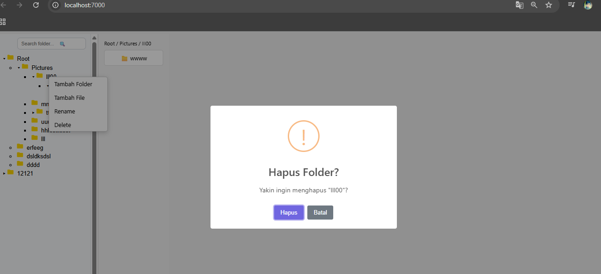
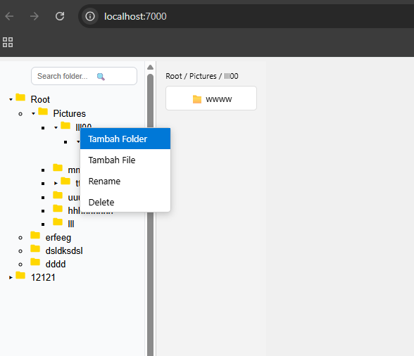

# explorer_frontend

Frontend untuk Explorer File Manager – menggunakan **Vue 3 + Vite + TypeScript**.

Proyek ini berfungsi sebagai antarmuka web untuk mengelola folder dan file yang terhubung dengan backend *explorer_backend*.

---

## 🚀 Tech Stack

- **Vue 3**
- **Vite**
- **TypeScript**
- **Axios**
- **SweetAlert2**
- **FontAwesome Free Icons**

---

## 📁 Struktur Folder

```
explorer_frontend/
├─ src/
│  ├─ App.vue
│  ├─ main.ts
│  ├─ shims-vue.d.ts
│  ├─ components/
│  │  ├─ Breadcrumb.vue
│  │  ├─ FolderContent.vue
│  │  ├─ FolderNode.vue
│  │  ├─ FolderTree.vue
│  │  └─ Sidebar.vue
│  └─ services/
│     └─ folderService.ts
│  └─ assets/
│     ├─ folder.svg
│     ├─ folder-open.svg
│     ├─ file.svg
│     ├─ style.css
│     ├─ view_delete.png
│     └─ view_tambah_folder.png
├─ index.html
├─ package.json
├─ vite.config.ts
└─ tsconfig.json
```

---

## 📦 Instalasi

### 1. Pastikan Bun atau Node.js terpasang
```
bun --version
node -v
```

### 2. Install dependency
Jika menggunakan Bun:
```
bun install
```

Jika menggunakan NPM:
```
npm install
```

---

## ▶️ Menjalankan Development Server

```
bun run dev
```
atau
```
npm run dev
```

Aplikasi akan berjalan di:
```
http://localhost:5173
```

---

## 📡 Konfigurasi API

Edit file:  
`src/services/folderService.ts`

Ubah URL API sesuai backend Anda:

```ts
const API_BASE_URL = "http://localhost:7001";
```

---

## 🛠 Build untuk Production

```
bun run build
```
atau
```
npm run build
```

---

## 🖼 Preview Gambar (Catatan)
Karena gambar **view_delete.png** dan **view_tambah_folder.png** tidak di-upload ke chat, maka tidak bisa ditampilkan dalam README ini.

Letak file:
```
src/assets/view_delete.png
src/assets/view_tambah_folder.png
```




---

## 📄 Lisensi
Bebas digunakan untuk kebutuhan proyek Anda.
